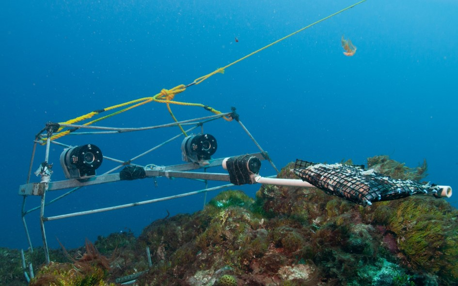

Tim Langlois, <a href="mailto:jordan.goetze@dbca.wa.gov.au">Jordan Goetze</a>, Todd Bond, Jacquomo Monk, Rene A. Abesamis, Jacob Asher, Neville Barrett, Anthony T. F. Bernard, Phil J. Bouchet, Matthew J. Birt, Mike Cappo, Leanne M. Currey-Randall,Damon Driessen, David V. Fairclough, Laura A.F. Fullwood, Brooke A. Gibbons, David Harasti, Michelle R Heupel, Jamie Hicks, Thomas H. Holmes, Charlie Huveneers, Daniel Ierodiaconou, Alan Jordan, Nathan A. Knott, Hamish A. Malcolm, Dianne McLean, Mark Meekan, David Miller, Peter J. Mitchell, Stephen J. Newman, Ben Radford, Fernanda A. Rolim, Benjamin J. Saunders, Marcus Stowar, Adam N. H. Smith, Michael J. Travers, Corey B. Wakefield, Sasha K. Whitmarsh, Joel Williams & Euan S. Harvey

 

 
 
<strong>Chapter citation:</strong> TBC

| Chapter Contents                                                                                                                                   |
|----------------------------------------------------------------------------------------------------------------------------------------------------|
|  **[Introduction](https://benthic-bruvs-field-manual.github.io/introduction)**                                                                     | 
|  **[Stereo-BRUV Design](https://benthic-bruvs-field-manual.github.io/stereo-BRUV-design)**                                                         |
|       _[Cameras and photogrammetry](https://benthic-bruvs-field-manual.github.io/stereo-BRUV-design#cameras-and-photogrammetry)_                   |
|       _[Bait](https://benthic-bruvs-field-manual.github.io/stereo-BRUV-design#bait)_                                                               |
|       _[Deployment time](https://benthic-bruvs-field-manual.github.io/stereo-BRUV-design#deployment-time)_                                         |
|  **[Sampling Design](https://benthic-bruvs-field-manual.github.io/sampling-design)**                                                               |
|  **[Field Logistics](https://benthic-bruvs-field-manual.github.io/field-logistics)**                                                               |   
|       _[Supp 2: Stereo-BRUV design variations](https://benthic-bruvs-field-manual.github.io/field-logistics#supp-2-stereo-bruv-design-variations)_ |
|       _[Supp 3: Field methodology checklists](https://benthic-bruvs-field-manual.github.io/field-logistics#supp-3-field-methodology-checklists)_   |
|       _[Pre-field work](https://benthic-bruvs-field-manual.github.io/field-logistics#pre-field-work)_                                              |
|       _[Pre-deployment](https://benthic-bruvs-field-manual.github.io/field-logistics#pre-deployment)_                                              |
|       _[Deployment](https://benthic-bruvs-field-manual.github.io/field-logistics#deployment)_                                                      |
|       _[Retrieval](https://benthic-bruvs-field-manual.github.io/field-logistics#retrieval)_                                                        |
|       _[End of day checks](https://benthic-bruvs-field-manual.github.io/field-logistics#end-of-day-checks)_                                        |           
|  **[Image Annotations](https://benthic-bruvs-field-manual.github.io/image-annotations)**                                                           |
|       _[Software](https://benthic-bruvs-field-manual.github.io/image-annotations#software)_                                                        |
|       _[Annotation metadata](https://benthic-bruvs-field-manual.github.io/image-annotations#annotation-metadata)_                                  |
|       _[Abundance estimates](https://benthic-bruvs-field-manual.github.io/image-annotations#abundance-estimates)_                                  |
|       _[Body-size measurements](https://benthic-bruvs-field-manual.github.io/image-annotations#body-size-measurements)_                            |
|       _[Supp 5: Recommended stereo-measurement length rules for EventMeasure](https://benthic-bruvs-field-manual.github.io/image-annotations#supp-5-recommended-stereo-measurement-length-rules-for-eventmeasure)_ |
|       _[Behaviour](https://benthic-bruvs-field-manual.github.io/image-annotations#behaviour)_                                                      |
|       _[Interoperable and reproducible annotations](https://benthic-bruvs-field-manual.github.io/image-annotations#interoperable-and-reproducible-annotations)_ |
|       _[Habitat classification](https://benthic-bruvs-field-manual.github.io/image-annotations#habitat-classification)_                            |
|       _[Quality control and data curation](https://benthic-bruvs-field-manual.github.io/image-annotations#quality-control-and-data-curation)_      |
|       _[Data storage, discoverability and release](https://benthic-bruvs-field-manual.github.io/image-annotations#data-storage-discoverability-and-release)_ |
|       _[Supp 6: Australian standards for data management, release, and discoverability of stereo-BRUV data](https://benthic-bruvs-field-manual.github.io/image-annotations#supp-6-australian-standards-for-data-management-release-and-discoverability-of-stereo-bruv-data)_ |
|       _[Supp. 7: Australian national BRUV working group, as of May 2020.](https://benthic-bruvs-field-manual.github.io/image-annotations#supp-7-australian-national-bruv-working-group-as-of-may-2020)_ |
|  **[Conclusion](https://benthic-bruvs-field-manual.github.io/conclusion)**                                                                         |
|  **[Acknowledgements](https://benthic-bruvs-field-manual.github.io/acknowledgements)**                                                               |
|  **[Field Manual Maintenance](https://benthic-bruvs-field-manual.github.io/field-manual-maintenance)**                                             |  
|  **[References](https://benthic-bruvs-field-manual.github.io/references)**                                                                         |                  

<a href="#" class="scrollUpButton">Top</a>